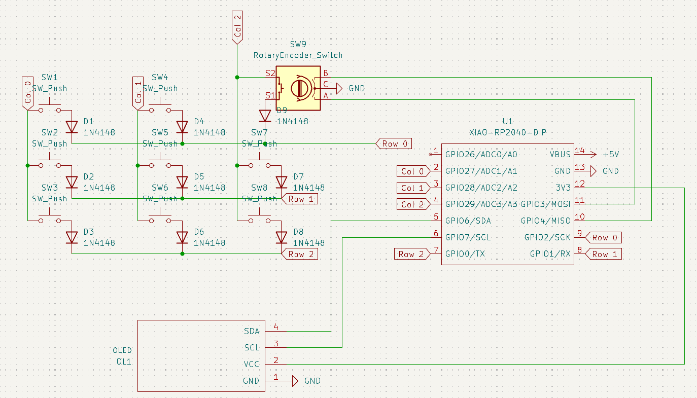
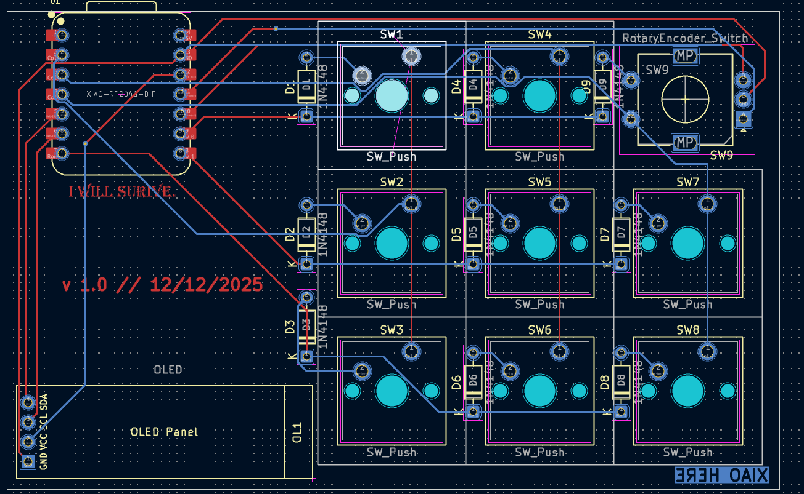
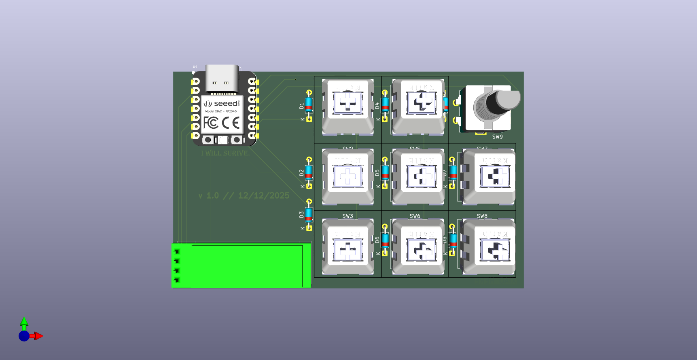
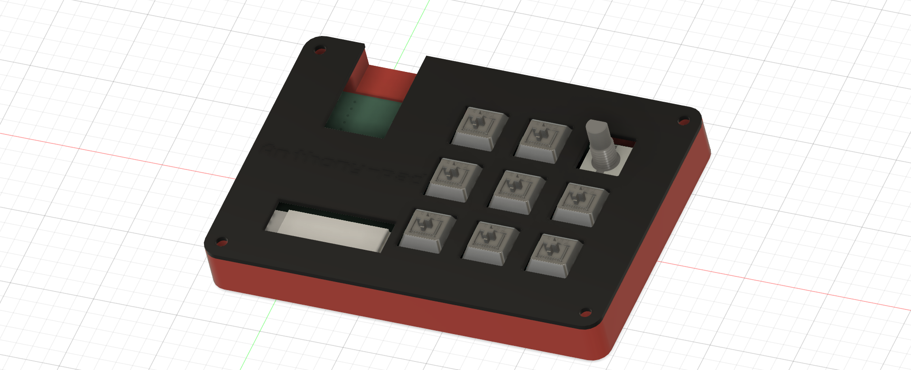

# Anthony Pad

This is a custom pad I designed, featuring 8 keys that function as shortcuts and macros, a rotary encoder for volume control, and an OLED display to show the run-time of the macropad.
For this project, I used KiCad to design the PCB, Fusion 360 to model the 3D case, and I wrote the firmware in Python using the KMK library.

